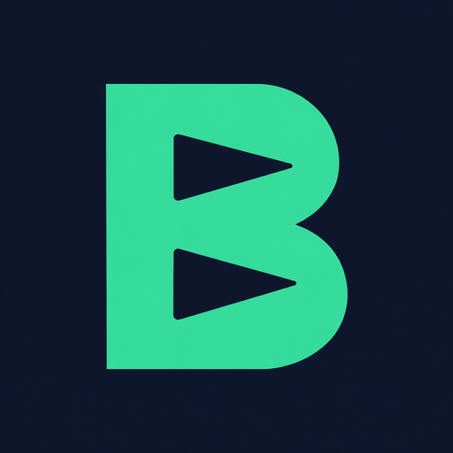

<div align="center">
  
  <h1>BidLume</h1>
  <p><strong>Local-first risk and fit scoring for Upwork job listings.</strong></p>
</div>

BidLume is an open-source Manifest V3 browser extension for freelancers who use Upwork. It reads the visible details of supported job and search pages, calculates a local score, highlights risk and quality signals, compares the listing with your skills and rates, and keeps a local analysis history. Optional AI analysis is available with your own provider key (BYOK).

> BidLume is an independent project. It is not affiliated with, endorsed by, or sponsored by Upwork.

Previously **UpLens**. Version **1.0.3** introduces the BidLume name and icon while keeping the same Chrome Web Store item, settings, and local history. The repository URL remains unchanged so existing links continue to work.

[Install from the Chrome Web Store](https://chromewebstore.google.com/detail/eipepdcljdgekijmegfdeohkhkldkkdc) · [Report an issue](https://github.com/AybarsOnurlu/Uplens/issues)

The store may still show the previous name until the 1.0.3 update is reviewed and published.

## Features

- Local heuristic scoring for posting risk, client quality, budget fit, listing quality, and skill match.
- Inline scores on supported Upwork search pages and a detailed popup report on job pages.
- Red-flag detection for signals such as off-platform contact, advance-payment requests, weak client history, unrealistic urgency, and budget mismatch.
- Local profile settings for skills, minimum hourly/fixed rates, theme, language, and analysis history.
- Optional BYOK AI summaries and CV skill extraction. Requests go directly from the browser to the provider selected by the user.
- OpenAI, Gemini, Groq, selected OpenAI-compatible providers, and localhost-compatible endpoints such as Ollama or LM Studio.
- Seven complete UI locales: English, Turkish, German, French, Spanish, Portuguese, and Arabic.

## Privacy model

Core scoring does not require an account, analytics service, or BidLume server.

| Data | Default handling | External transfer |
| --- | --- | --- |
| Visible Upwork listing/client details | Processed locally; analyzed job details may be stored in local history | Only when optional AI analysis is used |
| Skills, rates, theme, and language | Stored in `chrome.storage.local` | Skills may be included in an optional AI request |
| API credential | Stored in `chrome.storage.local` | Sent only to the selected AI provider as required for authentication |
| CV text | Used for the requested extraction operation | Sent only when the user starts optional AI skill extraction |

See the full [privacy policy](privacy.md). BidLume does not include analytics or advertising code.

## Install from source

1. Clone this repository.
2. Open `chrome://extensions/` in Chrome or a Chromium-based browser.
3. Enable **Developer mode**.
4. Select **Load unpacked** and choose the repository root (the folder containing `manifest.json`).
5. Pin BidLume, open its popup, choose a language, and follow the onboarding steps.

No dependency installation or build step is required to load the extension.

## Development and validation

Node.js 20 or newer is recommended. The automated suite uses Node's built-in test runner and mocked network/browser APIs, so no package download is required.

```bash
npm test
npm run validate
npm run check
npm run build:store
```

`npm run build:store` validates the source, creates a production-only folder, and writes a versioned ZIP under the local `Store_Submission/` directory. Store working files and generated ZIPs are intentionally ignored by Git and are not part of the public source tree.

For optional real-Chromium release checks, install Playwright in your development environment and run `node scripts/check-browser.mjs Store_Submission/bidlume-production-build-v1.0.3` after packaging. `PLAYWRIGHT_MODULE` and `CHROME_EXECUTABLE` can point to an existing Playwright installation and Chromium executable. The script uses a separate disposable profile, checks all seven locales in both themes, verifies retained storage and the service-worker scoring flow, and saves example-data captures locally. It never accesses your personal browser profile or calls a paid AI provider.

## Permissions

- `storage`: saves settings, credentials, and analysis history locally.
- `https://*.upwork.com/*`: reads supported Upwork job content and displays scores.
- Optional provider hosts: requested only after the user configures and invokes BYOK AI functionality for that provider.

The extension does not request broad browsing-history, tabs, cookies, downloads, or remote-code permissions.

## Project structure

```text
analysis/       Local scoring, client/budget checks, and risk rules
content/        Upwork page extraction, inline badges, and overlay
icons/          Extension icons declared by the manifest
lib/            Bundled local CSS (no CDN dependency)
popup/          Popup UI, settings, history, themes, and onboarding
scripts/        Validation, local visual harness, and store packaging
tests/          Dependency-free unit/integration and browser mocks
utils/          AI routing, i18n, messaging, and local storage helpers
manifest.json   Manifest V3 entry point and permission declarations
sw.js           Background service worker
privacy.md      Public privacy policy
```

## Responsible use and limitations

BidLume provides decision support, not a guarantee that a listing or client is safe, legitimate, or suitable. Scores depend on the visible information available on the page. Upwork can change its page structure, so extraction selectors may require maintenance over time. Never share passwords, government identifiers, banking credentials, or advance payments based on a listing.

## Contributing

### Support development

[Support on Patreon](https://www.patreon.com/cw/AybarsOnurlu). This is an optional external link, not a subscription requirement. All extension features remain free; optional cloud AI usage is billed separately by your chosen provider.

Bug reports and focused pull requests are welcome. Read [CONTRIBUTING.md](CONTRIBUTING.md) before submitting changes. For security-sensitive reports, follow [SECURITY.md](SECURITY.md).

## License

BidLume is available under the [MIT License](LICENSE).
